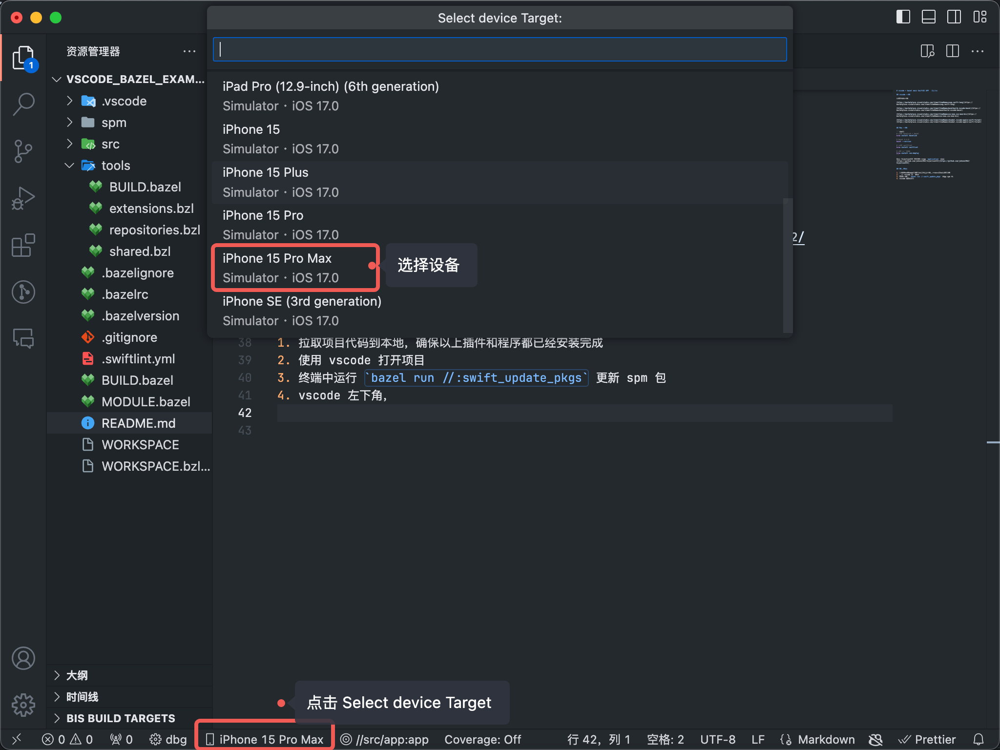
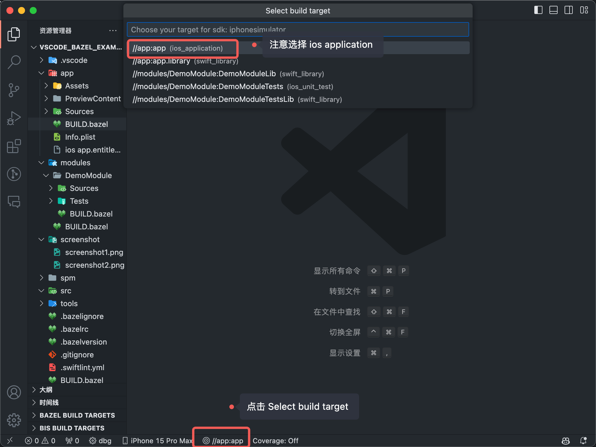
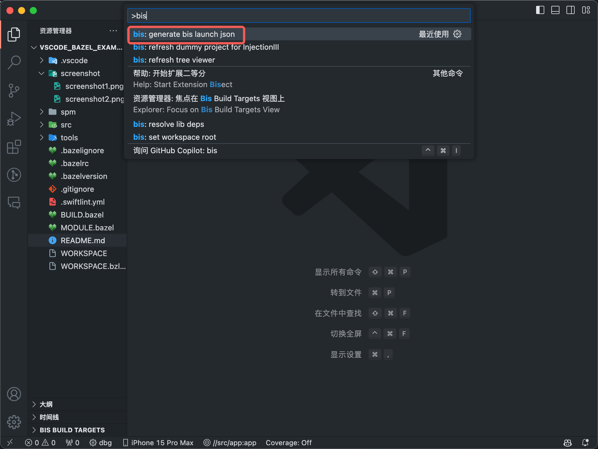
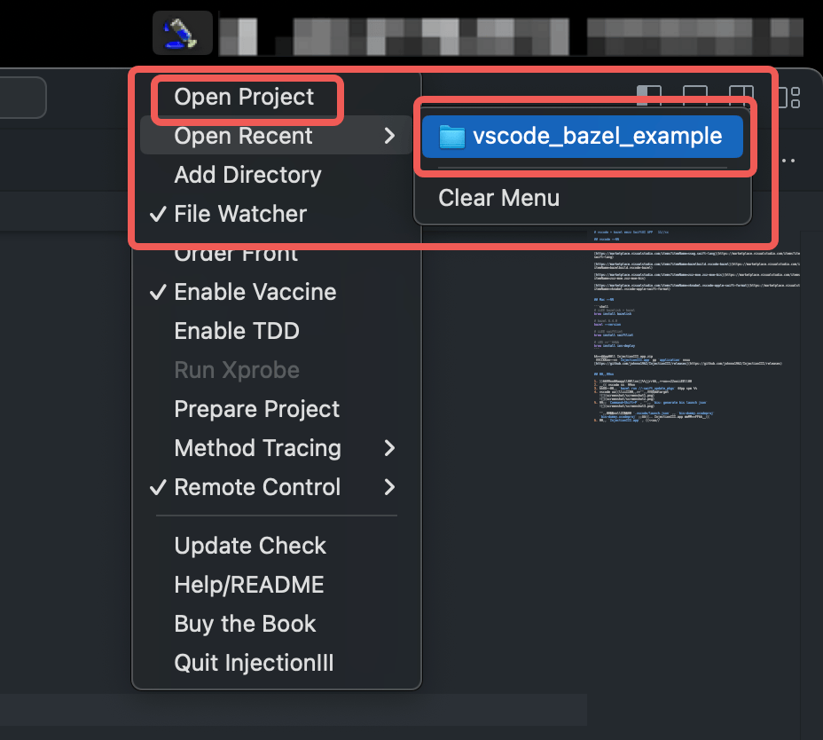
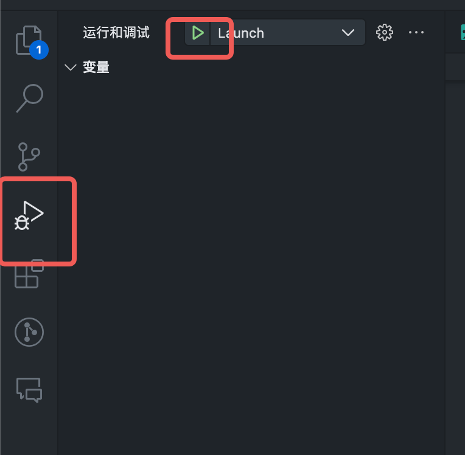
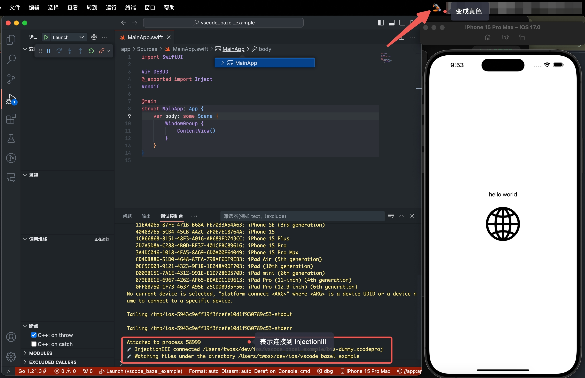
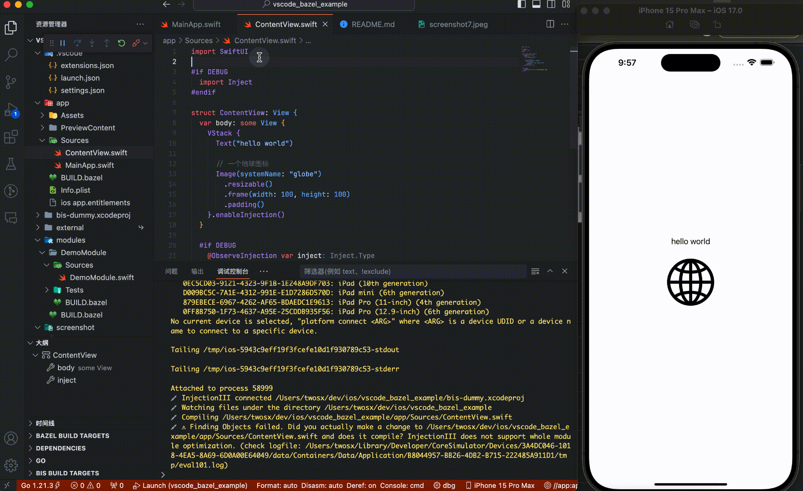

# vscode + bazel 搭建 SwiftUI APP 开发环境

> 放下 Xcode，体验 vscode 的编码流畅，bazel 的构建速度，再加上 copilot 的代码自动补全，泰裤辣！

## vscode 配置

安装以下插件:

[https://marketplace.visualstudio.com/items?itemName=sswg.swift-lang](https://marketplace.visualstudio.com/items?itemName=sswg.swift-lang)

[https://marketplace.visualstudio.com/items?itemName=bazelbuild.vscode-bazel](https://marketplace.visualstudio.com/items?itemName=bazelbuild.vscode-bazel)

[https://marketplace.visualstudio.com/items?itemName=zxz-moe.zxz-moe-bis](https://marketplace.visualstudio.com/items?itemName=zxz-moe.zxz-moe-bis)

[https://marketplace.visualstudio.com/items?itemName=vknabel.vscode-apple-swift-format](https://marketplace.visualstudio.com/items?itemName=vknabel.vscode-apple-swift-format)


## Mac 配置

> 系统版本: 14 以上
> 
> Xcode 版本: Version 15.0.1 (15A507)

```shell
# 安装 bazelisk + bazel
brew install bazelisk

# bazel 6.4.0
bazel --version

# 安装 swiftlint
brew install swiftlint

# iOS 设备管理
brew install ios-deploy

# 格式化工具
brew install swift-format
```

下载最新版本 InjectionIII.app.zip
 并解压后复制 `InjectionIII.app` 到 `application` 目录
[https://github.com/johnno1962/InjectionIII/releases](https://github.com/johnno1962/InjectionIII/releases)


## 运行项目

1. 拉取项目代码到本地，确保以上插件和程序都已经安装完成
2. 使用 vscode 打开项目
3. 终端中运行 `bazel run //:swift_update_pkgs` 更新 spm 包
4. vscode 底部，选择运行设备和编译的target
   
   
5. 点击 `Command+Shift+P` , 执行 `bis: generate bis launch json`
   
   
   执行成功后，会生成 `.vscode/launch.json` 和 `bis-dummy.xcodeproj`
   `bis-dummy.xcodeproj` 主要用于 InjectionIII.app 热重载识别使用
6. 运行 `InjectionIII.app` , 打开对应的项目, 用于监听程序热重载
   
7. 切换到运行窗口，点击 ▶️ 运行项目
   

运行成功：



开始Coding，copilot 补全，保存代码自动热重载更新界面，泰裤辣！




## 相关工具和教程

- [bis](https://github.com/xinzhengzhang/bis)
- [bazel-ios-swiftui-template](https://github.com/mattrobmattrob/bazel-ios-swiftui-template)
- [Bazel Tutorial: Build an iOS App](https://github.com/bazelbuild/rules_apple/blob/master/doc/tutorials/ios-app.md)
